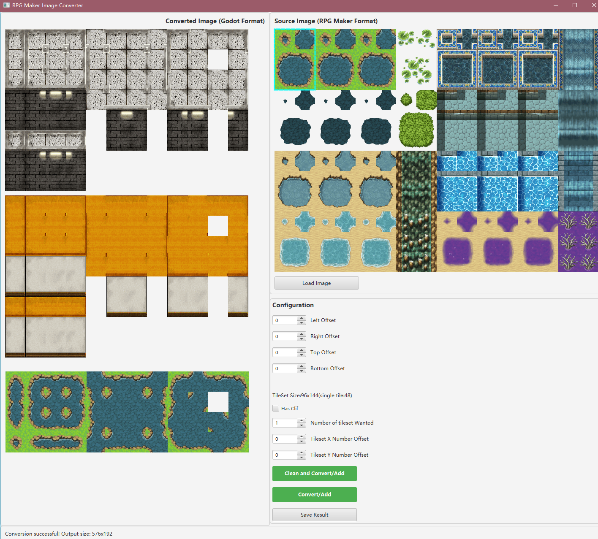

# RPG TileSet Converter

A tool to convert RPG Maker tileset images to Godot engine format. This is a Java application supporting both GUI and command-line interfaces.

## 📋 Project Overview

**RPG TileSet Converter** is a professional image processing tool designed for game developers to quickly convert terrain tileset formats. The tool employs sophisticated image processing algorithms to convert RPG Maker standard format (192×64) tilesets into Godot engine-compatible format (192×144).


### Core Conversion Pipeline

```
RPG Maker Format (192×64)
        ↓
   Quad Sampling (Mini Tiles: 80×16)
        ↓
   Mini Tile Substitution Mapping
        ↓
  Godot Format (192×144)
```

## ✨ Key Features

- ✅ **Graphical User Interface** - Intuitive UI built with JavaFX
- ✅ **Real-time Preview** - See the conversion result before saving
- ✅ **Flexible Edge Handling** - Support for left, right, top, and bottom offset adjustments
- ✅ **Command-line Tool** - For batch processing and automation
- ✅ **Multi-format Support** - Support for PNG, JPG and other common image formats
- ✅ **Precise Algorithm** - Based on RPG Maker's standard tileset specifications

## 🛠️ Technology Stack

| Technology | Version |
|------------|---------|
| **Java** | 17+ |
| **JavaFX** | 21.0.1 |
| **Build Tool** | Maven |
| **License** | MIT |

## 📦 Installation & Usage

### Prerequisites

- Java 17 or higher
- Maven 3.6+

### Build Project

```bash
cd RpgTileSetConveter
mvn clean package
```

### Method 1: Graphical Interface

```bash
mvn javafx:run
```

Or run directly:

```bash
java -cp target/classes org.greg.image.ImageConverterMain
```

**GUI Usage Steps:**

1. Click the "Open Image" button to select an RPG Maker source image
2. Use spinners to adjust boundary offset parameters if needed
3. Preview the conversion result on the right side
4. Click "Save" button to export the Godot format image

### Method 2: Command-line Tool

Basic usage:

```bash
java -cp target/classes org.greg.image.ImageConverterCLI <input_file> <output_file> [left_offset] [right_offset] [top_offset] [bottom_offset]
```

**Examples:**

```bash
# Simple conversion
java -cp target/classes org.greg.image.ImageConverterCLI input.png output.png

# With boundary offset adjustments
java -cp target/classes org.greg.image.ImageConverterCLI input.png output.png 2 3 1 2
```

**Parameter Description:**

| Parameter | Description | Default |
|-----------|-------------|---------|
| Input File | Path to RPG Maker source tileset image | Required |
| Output File | Path to save converted Godot format image | Required |
| Left Offset | Left boundary pixel offset | 0 |
| Right Offset | Right boundary pixel offset | 0 |
| Top Offset | Top boundary pixel offset | 0 |
| Bottom Offset | Bottom boundary pixel offset | 0 |

## 📁 Project Structure

```
RpgTileSetConveter/
├── pom.xml                          # Maven configuration
├── src/
│   ├── main/
│   │   ├── java/org/greg/image/
│   │   │   ├── ImageConverterMain.java      # Application entry point
│   │   │   ├── ImageConverterUI.java        # JavaFX graphical interface
│   │   │   ├── ImageConverterCLI.java       # Command-line tool
│   │   │   ├── ImageConverter.java          # Core conversion engine
│   │   │   └── DraggableNodeDemo.java       # UI utility
│   │   └── resources/
│   └── test/java/
├── target/                          # Compiled output directory
└── README_EN.md                     # This file
```

## 🔧 Core Classes

### ImageConverter

**Primary Responsibility:** Core image conversion engine

| Method | Function |
|--------|----------|
| `convertToGodotImage()` | Convert RPG Maker format to Godot format |
| `setOffsets()` | Set boundary offset parameters |
| `copyTile()` | Copy a single tile |
| `applySubtileData()` | Apply mini tile mapping |

### ImageConverterUI

**Primary Responsibility:** Provides user-friendly graphical interface

**Main Features:**
- Image loading and preview
- Real-time parameter adjustment
- Result visualization
- File export

### ImageConverterCLI

**Primary Responsibility:** Provides command-line interface for batch processing

## 📊 Algorithm Explanation

### Conversion Steps

#### 1. Quad Sampling (Mini Tiles Generation)

- Sample from RPG Maker source image (192×64) two main tiles
- Divide each tile into 4 quadrants for processing
- Generate intermediate representation (80×16)

#### 2. Mini Tile Mapping

- Use predefined 3×3 grid substitution mapping (48 entries total)
- Each target tile consists of 3×3 grid source tile references
- Systematically assemble the final Godot format image

#### 3. Output Format

- Final output: 192×144 pixels (4 rows × 12 columns of tiles)
- Each tile: 48×48 pixels
- Support for alpha channel (ARGB)

## 🎮 Use Cases

- Migration from RPG Maker MV/MZ to Godot
- Game asset format conversion
- Batch terrain tileset processing
- Game development workflow optimization

## ⚙️ Configuration

### Boundary Offset Parameters

Boundary offset parameters are used to fine-tune tile edge detection to accommodate different art styles:

| Parameter | Function | Adjustment Range |
|-----------|----------|------------------|
| **leftOffset** | Move left boundary to the right (pixels) | 0-10 pixels |
| **rightOffset** | Move right boundary to the right (pixels) | 0-10 pixels |
| **topOffset** | Move top boundary downward (pixels) | 0-10 pixels |
| **bottomOffset** | Move bottom boundary downward (pixels) | 0-10 pixels |

**Debug Tips:**

1. Start with all offsets at 0
2. Gradually adjust parameters to match your tileset style
3. Preview effects in real-time in the GUI
4. Record the optimal parameters for future use

## 🐛 Troubleshooting

### Issue: Converted image displays incorrectly

**Solution:**
- Verify source image is in RPG Maker standard format (192×64 or multiples)
- Adjust boundary offset parameters
- Confirm input image contains 2 main tiles (at positions 0,0 and 1,0)

### Issue: Command-line tool cannot find main class

**Solution:**
```bash
# Ensure project is built
mvn clean package

# Use JAR file
java -cp target/RpgTileSetConverter-1.0-SNAPSHOT.jar org.greg.image.ImageConverterCLI input.png output.png
```

### Issue: JavaFX-related errors

**Solution:**
```bash
# Use Maven plugin to launch
mvn clean javafx:run

# Or specify JVM module parameters
java --module-path /path/to/javafx-sdk/lib --add-modules javafx.controls,javafx.fxml -cp target/classes org.greg.image.ImageConverterMain
```

## 💡 Examples

### Example 1: Simple Conversion

```bash
java -cp target/classes org.greg.image.ImageConverterCLI terrain.png terrain_godot.png
```

### Example 2: Conversion with Adjusted Parameters

```bash
java -cp target/classes org.greg.image.ImageConverterCLI terrain.png terrain_godot.png 2 2 1 1
```

### Example 3: Using GUI Tool

1. Run GUI: `mvn javafx:run`
2. Click "Open Image" and select `terrain.png`
3. Adjust left, right, top, and bottom spinners
4. Click "Save" to export result

## 📝 Input File Format Requirements

**RPG Maker Tileset Format Standard:**

```
+--------+--------+
|  Tile  |  Tile  |
|  (0,0) |  (1,0) |
+--------+--------+
| 192×64 pixel area |
|    192 × 64      |
+--------+--------+
```

- **Width:** 192 pixels (two 96×48 tiles) or multiples
- **Height:** 64 pixels (one 48-pixel tall tile) or multiples
- **Color Space:** RGBA (alpha channel support)
- **Recommended Format:** PNG (preserves transparency)

## 🚀 Performance Metrics

- **Conversion Speed:** < 100ms (typical case)
- **Memory Usage:** ~ 50-100MB (depends on input size)
- **Maximum Supported Image:** 4096×4096 pixels

## 📚 Reference Resources

- [RPG Maker Official Documentation](https://rmmv.net/)
- [Godot Engine Documentation](https://docs.godotengine.org/)
- [JavaFX Documentation](https://openjfx.io/)

## 📄 License

This project is licensed under the **MIT License**. See the LICENSE file for details.

## 👨‍💻 Contributing

Contributions, issues, and pull requests are welcome!

**Contribution Steps:**

1. Fork this repository
2. Create a feature branch (`git checkout -b feature/AmazingFeature`)
3. Commit your changes (`git commit -m 'Add some AmazingFeature'`)
4. Push to the branch (`git push origin feature/AmazingFeature`)
5. Submit a Pull Request

## 📧 Contact

- Author: Greg
- Email: [your-email@example.com]
- GitHub: [your-github-profile]

## 🙏 Acknowledgments

Thanks to all developers using and supporting this project!

---

**Last Updated:** May 29, 2026

**Version:** 1.0-SNAPSHOT

**Language:** [中文](README.md) | [English](README_EN.md)

